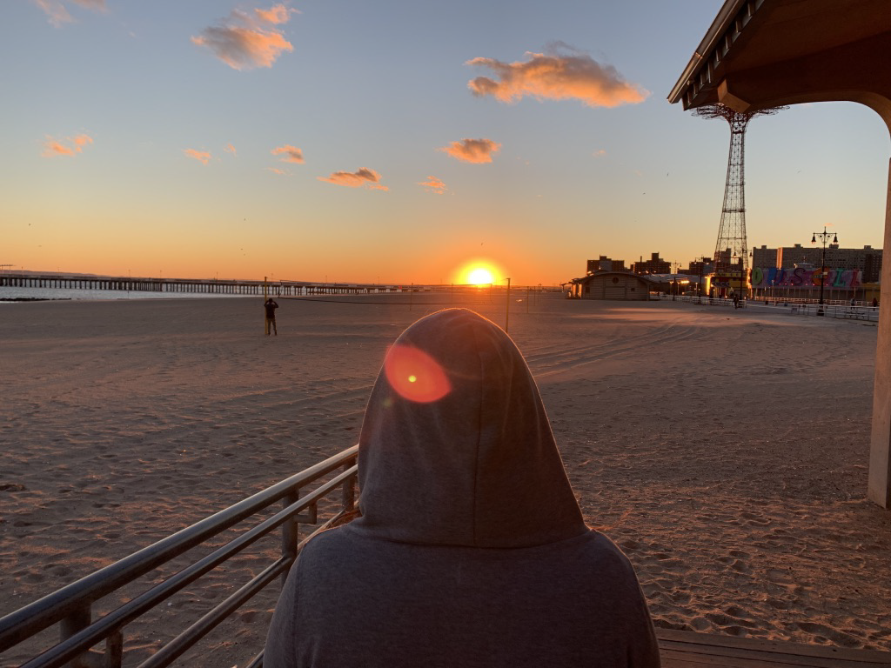

## ¿Qué es Registro Viajero?

Registro viajero es una plataforma conformada por un blog de viajes, episodios de podcast y aprovechamiento de las redes sociales. Que tiene como objetivo brindar información detallada de diferentes lugares para viajar y ponerla a disposición de todo aquel que esté planificando su viaje o simplemente que esté interesado en dicho destino.
\
Me siento muy identificado con la frase “Los viajes se viven 3 veces: cuándo los planeamos, cuando los vivimos, y cuando los recordamos”. Al publicar un post, una foto o un episodio en el podcast, siento que mantengo vivos esos recuerdos que tanta felicidad me generan. De paso, me permito devolver algo de lo que tanto me ha aportado la comunidad de viajeros activos en internet, ya que al planificar mis propios viajes me es de mucha utilidad todos los tips que voy encontrando en cada uno de los blogs, paginas y libros en los cuales investigo.

Hablando de los blogs y paginas que consulto, en el desarrollo de esta plataforma he tratado de eliminar todas esas molestias que encuentro cuando estoy navegando en internet. Como la cantidad abrumadora de información, pantallas saturadas, paginas de difícil manejo y la falta de información que parece ser obvia, pero que genera mucho estrés no saberla. Es por eso que me he esmerado por hacer un blog con diseño simple y elegante, sin tantos elementos que distraigan al lector y herramientas complementarias que ayuden a desarrollar con más profundidad cada uno de los destinos.
\
Los que somos apasionados por los viajes sabemos de la importancia de planificarlos. Estar seguros de los sitios que vamos a visitar, el querer explorar a fondo cada ciudad a dónde vamos y sacar el máximo provecho al tiempo de estadía. Es por eso que cada post que publique va a contener una ardua investigación del destino, consejos y vivencias propias. Por qué tú sabes, aveces las cosas no salen como se planean. Los lugares registrados en el blog serán lugares visitados por mi, por lo cual es mi deseo, la lista crezca cada vez mas.
\
Por ultimo, espero que la información consignada en esta plataforma sea de gran ayuda. Recuerda que mis opiniones están basadas en vivencias propias, por lo que todos los tips y consejos no son patrocinados.
\
Sígueme en mi Instagram @registroviajero para ver mas tips acompañados de espectaculares fotos que voy tomando en mis recorridos, también te recomiendo escuchar mis podcasts donde se amplia la información de cada destino. Si tienes alguna duda, comentario o quieres contactarme por cualquier razón, puedes ir a la sección de contacto.
